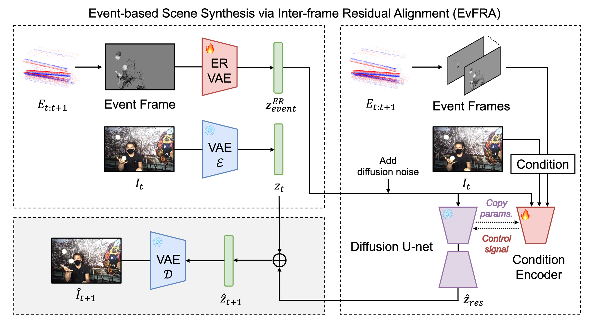

# EvFRA (ACCV 2026)
**Official repository for the ACCV 2026 paper, "Event-based Scene Synthesis via Inter-Frame Residual Alignment"**

\[Paper (coming soon)\]
\[Supp (coming soon)\]

## Overview



EvFRA synthesizes a target RGB frame from an anchor frame and the events recorded after it, without optical flow.
It is built on the correspondence between the events captured between two frames and the residual between those frames.

- **Stage 1: ER-VAE (Event-to-Residual Alignment VAE).** The Stable Diffusion 2.1 VAE encoder is fine-tuned so that the
  latent of the accumulated event frame matches the inter-frame residual latent `z_{t+1} - z_t`.
- **Stage 2: Residual diffusion.** A ControlNet on a frozen SD 2.1 UNet denoises the residual latent, conditioned on
  multi-scale event stacks. Denoising starts from the ER-VAE event latent, and the anchor frame is injected through
  CLIP image tokens and 4x4 latent tokens. The target frame is decoded from `z_t + z_res`.

The same model handles **video frame interpolation (VFI)**: the target is predicted forward from the preceding
frame and backward from the subsequent frame with the time-reversed events, and the two predictions are blended
with weights inversely proportional to their temporal distance.

## Requirements
* Python 3.10
* PyTorch 2.4.1
* CUDA 12.1


## Installation

Download repository:

```bash
    $ git clone https://github.com/<ORG>/EvFRA
    $ cd EvFRA
```

Create the conda environment:

```bash
    $ conda create -n EVFRA python=3.10 -y
    $ conda activate EVFRA
    $ pip install -r requirements.txt
```

EvFRA uses [Stable Diffusion 2.1](https://huggingface.co/stabilityai/stable-diffusion-2-1) (VAE, UNet) and the
`laion/CLIP-ViT-H-14-laion2B-s32B-b79K` image encoder, which are downloaded from the Hugging Face Hub on first use.
If Stable Diffusion 2.1 is not available from the Hub in your environment, pass a local copy in diffusers format
(with `vae/` and `unet/` subfolders) through `--pretrained_model_name_or_path`.

## 🚀 Quick Test

### 1. Download datasets

* **BS-ERGB**: download from the official [TimeLens++ repository](https://github.com/uzh-rpg/timelens-pp).
* **HS-ERGB**: download from the official [TimeLens repository](https://github.com/uzh-rpg/rpg_timelens).
* **GoPro**: download "GoPro with raw events" from the [EFNet repository](https://github.com/AHupuJR/EFNet)
  (Event-based Fusion for Motion Deblurring with Cross-modal Attention, ECCV'22).
  
Place the datasets in `./data` with the following structure.
The events between frame `i` and frame `i+1` are stored in `i.npz`.

```
├── data/
│   ├── bs_ergb/
│   │   ├── train/
│   │   │   ├── acquarium_01/
│   │   │   │   ├── images/
│   │   │   │   │   ├── 000000.png
│   │   │   │   │   ├── ...
│   │   │   │   ├── events/
│   │   │   │   │   ├── 000000.npz      # x, y, timestamp, polarity
│   │   │   │   │   ├── ...
│   │   │   ├── ...
│   │   ├── valid/
│   │   ├── test/
│   ├── hs_ergb/
│   │   ├── close/test/
│   │   │   ├── baloon_popping/
│   │   │   │   ├── images_corrected/
│   │   │   │   ├── events_aligned/     # x, y, t, p
│   │   │   ├── ...
│   │   ├── far/test/
│   ├── gopro/
│   │   ├── test_converted/
│   │   │   ├── GOPR0384_11_00/
│   │   │   │   ├── images/
│   │   │   │   ├── events/             # x, y, timestamp, polarity
│   │   │   ├── ...
```

Events are converted on the fly into a 10-level multi-scale event stack (`evfra/events.py`), so no preprocessing step is needed.

** Cautions:
* The x, y coordinates of the raw BS-ERGB event files are multiplied by 32.
* In 11 of the 15 HS-ERGB test sequences, the event stream ends before the last frames.
  Anchors whose target frames have no events are skipped during evaluation.

### 2. Download pretrained weights

Download the pretrained weights (trained on BS-ERGB) and place them in `./checkpoints/evfra`.

🔗 **EvFRA (VFP)**: coming soon

Make sure the final structure is:

```
├── checkpoints/
│   ├── evfra/
│   │   ├── controlnet/
│   │   │   ├── config.json
│   │   │   ├── diffusion_pytorch_model.safetensors
│   │   ├── latent_tokenizer.pth
│   │   ├── er_vae.pt
```

### 3. Run test scripts

```bash
    $ bash scripts/evaluate.sh bs_ergb      # 1 and 3 frames
    $ bash scripts/evaluate.sh hs_ergb      # 7 frames
    $ bash scripts/evaluate.sh gopro        # 7 and 15 frames
```

For interpolation, set `TASK=vfi` and point `CKPT` to the VFI weights:

```bash
    $ TASK=vfi CKPT=checkpoints/evfra_vfi bash scripts/evaluate.sh bs_ergb
```

For each anchor frame `t`, frames `t+1, ..., t+N` are predicted from frame `t` and the events since `t`, and the next
anchor is `t+N+1`. Frames are upsampled 2x, predicted in overlapping 512x320 patches, merged by a weighted average, and
resized back to the original resolution. PSNR / SSIM / LPIPS are averaged over all predicted frames, and anchor frames are not counted.

Predicted frames and per-frame metrics are saved in `./results/<dataset>_<N>frames/`.
By evaluating the output images, you can reproduce the quantitative results reported in the paper.


## 🚀 Train model on BS-ERGB

### 1. Stage 1: ER-VAE

```bash
    $ bash scripts/train_er_vae.sh          # -> experiments/er_vae/best.pt
```

### 2. Stage 2: Residual diffusion

Stage 2 is trained in three phases on 4 GPUs (effective batch size 64). Each phase starts from the `checkpoint-best`
of the previous phase, which is selected by the validation LPIPS.

```bash
    $ bash scripts/train.sh phase1
    $ bash scripts/train.sh phase2
    $ bash scripts/train.sh phase3
```

| Phase | Initialization of the residual latent | Loss | LR | Steps |
|---|---|---|---|---|
| 1 | Gaussian noise | EDM MSE + LPIPS + L1 | 2e-5 | 100k |
| 2 | ER-VAE event latent + noise | EDM MSE + LPIPS + L1 | 1e-5 | 80k |
| 3 | ER-VAE event latent + noise | EDM MSE + LPIPS + L1 + 0.5 event-weighted L1 | 5e-6 | 35k |

The released VFP model is the `checkpoint-best` of phase 3.

### 3. Interpolation

The VFI model is fine-tuned from the VFP model with a forward and a backward branch that share all weights.
Both residuals are supervised, and the pixel losses are applied to the blended frame.

```bash
    $ bash scripts/train.sh vfi
```

To export a checkpoint in the layout used by the test scripts:

```bash
    $ python tools/export_checkpoint.py --checkpoint_dir experiments/phase3/checkpoint-best \
        --er_vae_path experiments/er_vae/best.pt --output_dir checkpoints/evfra
```

## Reference

Coming soon.

## Contact
If you have any question, please send an email to jiyun.kong@yonsei.ac.kr

## Acknowledgements
This code builds on [diffusers](https://github.com/huggingface/diffusers) and
[Stable Diffusion 2.1](https://huggingface.co/stabilityai/stable-diffusion-2-1).
The ControlNet implementation is adapted from diffusers (Apache-2.0).

## License
The project codes can be used for research and education only.
